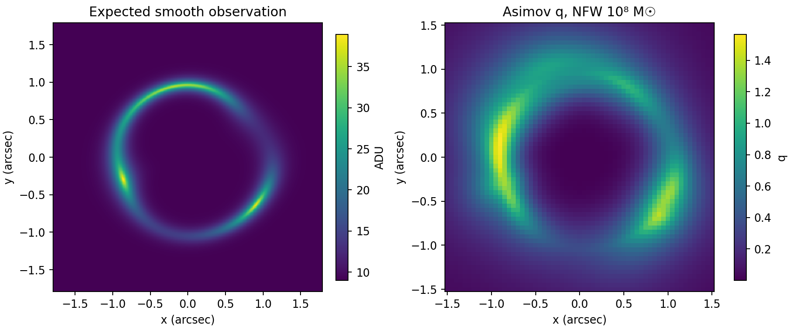

# hwoslaps

hwoslaps forecasts how well a telescope can detect dark-matter subhalos in galaxy-scale
strong gravitational lenses. Describe a lens, a source, an optical system and an exposure
in a configuration file, and hwoslaps predicts the detection significance of a subhalo of
a given mass at every position around the lensed arc. It can also simulate the
observation, fit it with full PyAutoLens lens models, and run populations of lenses as
resumable batches on CPUs or GPUs.



## Install

```bash
git clone https://github.com/nasa-jpl/hwo-slaps.git
cd hwo-slaps
bash install.sh --cpu --env-name hwo-slaps     # or --gpu on a CUDA 12 machine
conda activate hwo-slaps
```

## Run a forecast

```bash
hwoslaps forecast configs/minimal.yaml --masses 1e6 3e6 1e7 3e7 1e8 -o out/quickstart
```

```python
from hwoslaps import load_forecast, mass_reach, summarize

result = load_forecast("out/quickstart/forecast.npz")
summary = summarize(result, q_threshold=10.0)
reach = mass_reach(summary, quantity="q_max", target=10.0, interpolation="log")
print(f"smallest detectable mass: {reach.mass_msun:.3g} solar masses")
```

## Documentation

The handbook in `docs/` covers installation, a quickstart, how the forecast works, a
user guide for each task, worked examples including the HWO reference telescope, and the
full API and configuration reference. To build it:

```bash
python -m pip install -r docs/requirements.txt .
python -m sphinx -b html docs docs/_build/html
```

then open `docs/_build/html/index.html`.

## The RASTI paper

The code used for the RASTI paper is kept at the git tag `rasti-26-183-submitted`. This
version reproduces its forecasts for the paper's test scenes exactly; see
`docs/migration.md` for the interface changes.

## Copyright

Copyright 2025, by the California Institute of Technology. ALL RIGHTS RESERVED. United States Government Sponsorship acknowledged. Any commercial use must be negotiated with the Office of Technology Transfer at the California Institute of Technology.

This software may be subject to U.S. export control laws. By accepting this software, the user agrees to comply with all applicable U.S. export laws and regulations. User has the responsibility to obtain export licenses, or other export authority as may be required before exporting such information to foreign countries or providing access to foreign persons.

## Authors

Georgios Vassilakis (JPL)
