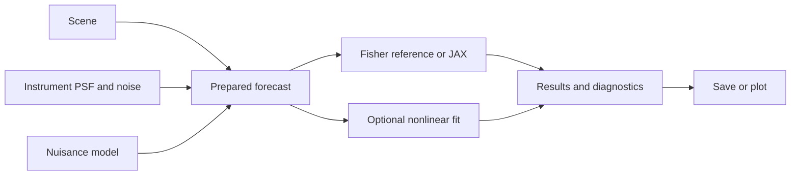

# Test audit and proposed forecasting engine

The next pass should delete RASTI reproduction machinery rather than retain a
study namespace in main. Git history and the submitted tag preserve the old
implementation. The reusable product is a configurable subhalo forecasting
engine with explicit scenes, instruments, noise, nuisance models, hypotheses,
and execution settings.

This is an audit and design proposal for `bf73e2c`. Source and tests were not
changed. Six discovery lanes inspected complete selected tests, production
owners, callers, overlapping proofs, relevant history, and selected dependency
implementations. The linked [OpenClaw test-audit skill](https://github.com/openclaw/openclaw/blob/main/.agents/skills/test-audit/SKILL.md)
provided the evidence and retention rules. Its JavaScript repository commands
were adapted to pytest and the pinned XTX runtime.

## Scope and measured evidence

The checkout contains 98 Python test/support files and 38,847 physical lines.
The 95 `test_*.py` files contain 1,443 declared test functions before pytest
parametrization. A static census found 23 test files referencing studies
(13,096 lines, including mixed scientific suites), 22 that read text, and 16
with custom module loaders. These are discovery signals, not deletion verdicts.
This was focused evidence-led discovery, not a completed per-declaration ledger
for every assertion in the repository. No coverage percentage was measured;
coverage tools are absent from the existing XTX environment.

The prior cleanup validation remains 2,107 CPU passes, 15 skips, one known
scheduler xfail, and 17 GPU passes. Those are previous regression receipts,
not proof that every test is valuable or that the proposed design is built.
The new audit ran 11 selected baseline controls and controlled faults in
separate disposable copies on XTX. All 11 baseline controls passed.

| Controlled fault | Weak proof that still passed | Stronger proof or oracle |
| --- | --- | --- |
| Change closed aperture `<=` to `<` | Old nextafter test never evaluates equality | Exact-radius geometry test failed |
| Image flux nuisance uses `intensity` instead of `flux_scale` | Copied direction-name inventory | Actual path contract failed |
| Report raw instead of profiled Fisher q | Local arithmetic-only q-fit test | Production profiling metric test failed |
| Declared `FreshProfileSettings` export resolves to `None` | Export inventory equality/subset test | Fresh-interpreter real import test failed |
| CSV serialization returns an empty mapping | Dataclass object-identity test | Actual serialization contract failed |
| Use transposed Cholesky whitening | Dense-covariance test shares production whitener on both sides | Independent inverse-covariance Schur calculation failed |

The independent covariance calculation gives 1.8801668806977838. Current
production gives 1.8801668806977836 and passes; the deliberately wrong whitener
gives 1.9118544440515426. This is a confirmed oracle weakness, not a demonstrated
current covariance bug.

Deleting the study profile adapter only in a disposable copy caused the entire
fresh-profile test module to skip at import. Selected-file pytest returned exit
5 with one module skip. A larger suite could continue passing while those
scientific regressions disappear. Test import ownership must be disentangled
before study deletion.

Audit receipts: `/data/home/gvassilakis/forecast-engine-test-audit-20261002/probe_prdi4oxa/`
contains `results.json`, individual logs, baseline/faulted snapshots, and the
independent covariance probe. GPUs were hidden; no production fits or campaigns
ran, dependencies were not installed, and reviewed source checkouts were not
modified.

## High confidence candidate ledger

Each entry records its actual failure mode, production consumers, stronger
proof or retirement reason, history, deletion unlocked, and validation risk.
D means delete; C means consolidate; F means strengthen or move first.

### 1 Arithmetic only q fit assertion D

[Arithmetic-only q-fit test](/Users/vassig/.codex/worktrees/forecast-engine-cleanup/hwo-slaps/tests/test_fisher_detection_metric_contracts.py:96) computes `2*(-100 - -105)` locally and never calls production. It cannot
catch a production regression; the controlled raw/profiled-q fault confirmed
this. The actual metric owner is `nonlinear/likelihood_metrics.py`, consumed by
validator, output, and mismatch inference. Keep production likelihood metric
and profiling tests. Introduced in `eb7b5b5`; delete this test without retaining a
production seam. Risk is negligible. Validate with
`pytest tests/test_nonlinear_likelihood_metrics.py tests/test_fisher_detection_metric_contracts.py`.

### 2 Export inventory equality D

[Export inventory test](/Users/vassig/.codex/worktrees/forecast-engine-cleanup/hwo-slaps/tests/test_nonlinear_import_boundaries.py:20) compares inventories derived from the same export map and copies a
subset of declared names. It passed when a real declared export returned None.
`__dir__` has legitimate interactive users and should not be deleted merely
because the weak test disappears. Keep the real subprocess import boundary at
line 7. Added by `bf73e2c`. Delete copied inventories; preserve installed-wheel
and actual-import smoke. Risk is low; run `pytest tests/test_nonlinear_import_boundaries.py`.

### 3 Dataclass assignment identity D

[Dataclass identity test](/Users/vassig/.codex/worktrees/forecast-engine-cleanup/hwo-slaps/tests/test_fresh_profile.py:469) checks construction and object identity, not inference or exported
values. Production `NonlinearCaseResult` is produced by the validator. Keep the
successful/failed JSON/CSV and file-roundtrip contracts in
`test_nonlinear_output_schema.py:59,95,131`; the CSV fault confirmed stronger
proof. Added during v7 development (`79d6119` lineage). Delete only the identity
test; no source capability needs removal. Risk is low; run output-schema and
fresh-profile owner suites.

### 4 Test only likelihood wrapper D

[profile_likelihood_q](/Users/vassig/.codex/worktrees/forecast-engine-cleanup/hwo-slaps/src/hwoslaps/modeling/nonlinear/local_profile.py:214) has no non-test callers in the repository; production uses
`likelihood_metrics.profile_likelihood_ratio`. Its two local-profile tests at
lines 34 and 40 duplicate the signed/clipped metric owner. Introduced with
`35b9667`. Remove this wrapper and public export together, retaining canonical
metric tests and signed semantics. Breaking changes are allowed. Risk is low;
validate likelihood metrics and real nonlinear validator tests.

### 5 Private nuisance and runtime wrapper layers C

The older `test_fisher_nuisance_subset_and_mask.py` builds a detector via `__new__`
and checks private selector wrappers. The new `test_fisher_nuisance.py` owns
those pure contracts. The former Image-name inventory passed a wrong parameter
path; the latter path test failed. Consolidate unique invalid-selector,
reserved-word, prior, and Image-path cases under the pure owner; keep real
runtime none/all/lens-only dispatch checks. History `a076195` then `bf73e2c`.
Remove duplicate private wrapper tests and fake package setup only after keeper
transfer. Risk is medium if negative cases disappear. Validate core, nuisance,
adapter, and real runtime tests.

Likewise, runtime policy/provenance private-wrapper tests duplicate the new
runtime owner, but propagation into actual result metadata is a distinct
contract. Preserve that in the real serial/parallel map test before removing
private wrapper layers. This is not permission to drop lifecycle or resource
admission proofs.

### 6 Shared dense covariance oracle F

[Dense-covariance test](/Users/vassig/.codex/worktrees/forecast-engine-cleanup/hwo-slaps/tests/test_fisher_core.py:122) sends both expected and actual through the same Whitener. The wrong
Cholesky orientation survived it. Production consumers are generic Fisher,
image adapters, and detector covariance setup; no stronger independent dense
oracle was found. Original `d0218bf`. Retain and strengthen this test using
independent solves for inverse-covariance Schur projection with nonuniform
covariance and priors. No deletion is justified. Validate the core suite and
repeat the controlled wrong-whitener check. Scientific risk is high if this
proof is discarded instead of strengthened.

### 7 Study namespaces and launcher inventories D

Source-only study command/import guards, fixed B200 profile packing, fixed
cohort/tier acceptance, exact shell dispatcher strings, release declarations,
and rank-stability stream names protect retired workflows. Their actual
consumers all live in the study tree. No proof is needed for intentionally
removed commands and namespaces. These came from frozen study/v7 development
and the cleanup relocation. Delete them with their owners; keep generic worker
failure, ordering, artifact integrity, and resource contracts only where a
supported engine feature still requires them. Validate installed imports and
retained numerical owners. Do not call legitimate old protocol tests junk;
the protocol is now retired.

### 8 COSMOS bank release assertions D after keeper transfer

`test_source_bank_assets.py:180,214,248` pins five assets, a 0.11 arcsec
preparation convention, HWO scene4 photometry, and a specific production grid.
The generic asset loader does not need those rate-contract fields. Introduced
by `9de3d9c`. Delete the bank and paper normalization defaults. Synthetic asset
format/flux/transform tests remain in `test_image_source.py`. First transfer the
absolute lensing-flux canary at lines 404–448 to a synthetic asset: it protects
against applying magnification twice. Risk is medium until that proof is moved;
validate source-image and real flux/magnification integration tests.

### 9 Frozen selection defaults D

`test_selection_score.py:344,580` pins 0.5 arcsec, SNR20, selected12/golden5.
The current non-test consumers are study scoring/report scripts. Keep physical
SNR, angular gradient power, dimensionless complexity, deterministic ranking,
and explicit caller policy. Remove paper constants/defaults and golden-tier
API. History `5660654`, configurability partial in `bf73e2c`. Keep explicit
threshold/top-k and permutation tests. Risk is deliberate API migration;
validate selection/population contracts. The reference-script SNR test at line
125 can retire because hand-calculated pixel/aperture cases provide independent
proof and no generic estimator needs a 2,134-line HWO derivation as its oracle.

### 10 Duplicate physical and detector proofs C

Consolidate `test_psf_hexike_alignment.py:74` under the stronger real multisegment
HCIPy coefficient/phase test in `test_psf_regressions.py:133`; retain distinct
validation cases. Dependency source confirms reflective factor two and Noll
indexing. Consolidate `test_observation_correctness.py:109` under the independent
CCD moment/noise-map owner in `test_detector_contract.py:18`; keep throughput,
Monte Carlo, and observation integration. Consolidate even-kernel rejection at
`test_observation_module.py:150` under the same actual boundary at
`test_observation_correctness.py:444`; constructor rejection remains distinct.
Histories include `f94d939`, `818505a`, and canonical owner added in `bf73e2c`.
Risk is low after unique contracts move. Run optics/OPD and detector/observation
owner tests. No physical implementation is deleted by these consolidations.

### 11 Dependency and storage inventories D or C

Retire `_can_import` and copied package/dependency/symbol inventories in
`test_installation.py:21,36,42`; actual optics/inference integration and a built
wheel imported outside the checkout are stronger owners. History `8c4869c`.
Retain installer-pin guards while a pinned backend installer is supported.
Delete `test_config_loading.py:113`, whose name claims import isolation but never
checks it; the actual CLI subprocess at `test_cli.py:23` does.

New artifact tests `test_artifacts.py:37,70` have useful metadata predicates but
stub the writer to create arbitrary bytes. Existing grid tests save and reload
real NPZ data. Consolidate real matching/absent/foreign snapshot cases at the
artifact owner using a genuine small result object; keep one pipeline wiring
proof. Added by `bf73e2c`. Medium risk until real persistence proof survives.
The CLI stub Pipeline is legitimate transport isolation, not automatically a
bad test. Keep its snapshot/log/config forwarding and artifact collision proof.

### 12 Archive acceleration and replay retirement D after extraction

`experimental_persistent.py` and `experimental_device.py` have only study replay
consumers. Their cache/lifecycle/admission tests are meaningful for those paths,
not inherently low value. With replay retired, delete those prototypes and
corresponding tests. Histories `cc96e07` and `6de0606`. The validated current JAX
objective, mass profiles, rendering kernels, and pooled Nautilus training stay.
Extract the generic linearized comparator from `profile_replay.py` before
removing its historical revision allow-list, saved-vector runner, and legacy
schema tests. Current calibration still calls that comparator. Validate the
current objective, sampling, profile acceptance, and CPU/GPU parity owners.

## Tests and infrastructure to preserve

Keep independent lens-distance/mass anchors, flux and magnification accounting,
source transform/normalization invariants, Airy/OPD/PSF energy checks, CCD
expectations and noise statistics, prior/nuisance invariance, numerical shape
rejection, sparse/dense and reference/JAX parity, real spawned worker failures,
JIT/gradient and nonfinite recovery, sampler pool restoration and serial/pooled
weight parity, output round trips, config/path negatives, and real package
imports. Private cache tests can be valuable when they prove bounded resource
use or mutation isolation. Static source inspection can remain when it is an
independent architecture or release contract.

Fix test ownership before deletion:

- `test_fresh_profile.py:15–31` combines engine and study imports under a broad
  import/attribute exception that skips its whole module. Separate study cases;
  a broken installed engine import must fail the pinned backend suite.
- `test_fisher_aperture_perimeter.py` imports a study reducer, and
  `test_fisher_ab_integration.py` imports study-runner fixtures. Move retained
  numerical fixtures to their engine owners first.
- `_lensing_physics_helpers.py:24–42` injects fake modules under real package
  names and caches them globally. Replace direct loaders with normal imports
  where dependency boundaries permit; retain the actual cosmology adapter.
- Global `conftest.py` injects study/scripts paths, imports AutoConf when present,
  and disables Numba JIT for every lane. Scope backend setup to backend tests.
- There is no tracked CI workflow. Add real minimal-install and backend lanes;
  markers alone do not solve optional imports during collection. Update stale
  test instructions referencing removed test files.

## Deletion inventory

Whole `studies/` contains 22,774 Python lines. Historical submission reproduction
helpers add 1,013. A 16-file study-owned test inventory adds 6,888. Together this
identifies 30,675 Python lines for retirement assessment, before mixed-suite and
core simplification. It is not an approved net-deletion number: valuable
scientific fixtures/contracts must migrate before those files can disappear.
For scale, removing that inventory without migration would reduce total Python
from 99,560 to 68,885, but that blind deletion would be unsafe.

The 16 study-owned files are campaign_ladder, production_harvest, design_freeze,
campaign_stage0, rank_stability, sweep_completed_attempts, execution_prepare,
release_dependencies, production_cli, run_stage0_observation, release_catalog,
bulk_launch, stage3_cli, selector_validation_analysis, run_ladder_tier_gate, and
stage3_memory_profiles (all `tests/test_*.py`). Mixed run_ladder, profile_replay,
fresh_profile, psf_knowledge, Fisher perimeter and AB suites need keeper transfer.

Remove paper-only config freezes, cohort assets, report inputs, release receipts,
and reproduction docs from the merge payload. Optional instrument presets and
providers may remain if they serve supported generic capabilities. Do not keep
a large HWO reference script only because a test uses it as an oracle; retain
or extract generic photometric/asset preparation only when there are actual
supported callers.

## Proposed engine design

Use one explicit scientific path:



### Forward model and instrument inputs

Own expected-image arithmetic once: ray trace, convolve, count normalization,
throughput, sampling, background, and variance. `simulate` adds a declared noise
stream; Fisher preparation uses expected data without allocating noisy images.
The current noiseless Fisher, observation, and inference adapters must share
this contract with parity tests.

Support two concrete PSF providers first: the existing segmented HCIPy optical
provider and an explicit detector-sampled external kernel. Both must work through
the same high-level forecast API. Never fabricate pupil/wavefront metadata for
an empirical kernel. Truth and fitted PSFs are separate inputs for mismatch
forecasts. Plotting/output directories do not belong in scientific validation.

Keep current analytic/image source and mass models with explicit coordinates,
units, redshifts, concentration/mass convention, cosmology, flux normalization,
and assets. Existing Planck15 and segmented-pupil limitations must remain honest;
new implementations need independent physical tests, not just broader accepted
YAML strings. A small named-provider boundary is enough; avoid a large registry
or inheritance framework before there is a second supported implementation.

### Forecast preparation and evaluation

The prepared context owns smooth expected data, fitted pixels, noise/covariance,
nuisance Jacobian, priors, projection workspace, and render/sampling identity.
A general candidate planner supplies positions and the full numerical domain.
Evaluation returns compact arrays for declared mass/position hypotheses.
Numeric detection threshold, area fractions, search/refinement bounds, and
stopping rules are explicit. Replace ladder-tier APIs and identity registry with
this context, candidate layout, evaluator, and result reducers.

Preserve FFT padding, batch/tail handling, interpolation, sparse/perimeter
optimizations, whole-domain radial bounds, reductions, float64, and mass-retarget
reuse as backend implementation details under the same scientific contract.
Reference NumPy and accelerated JAX implementations remain independently
comparable. Scientific configuration and execution resources are separate.

### Optional nonlinear inference

Keep `imaging_from_observation` and the current consistent sampling objective.
Remove historical objective default/reconstruction, old revision schemas,
saved-vector replay, fixed bracket/kernel adapters, and experimental replay
monkeypatch/cache routes. Retain generic calibration/comparator math separately.

One objective supplies residuals, log likelihood, bounds, parameter names,
optional gradients/Jacobian, and immutable rendering identity. A thin fitting
coordinator uses nested sampling and bounded profile refinement over that same
objective. Keep current acceptance gates and useful training acceleration.
Own compatibility/pool/cache lifetime in the backend/session adapter rather than
spreading global patches through reusable functions. This does not authorize
changing optimizer mathematics, priors, or default science during refactoring.

### Populations and execution

A population is an iterator of validated scenes/configurations. Keep independent
samplers and permit explicit input tables or caller-supplied conditional recipes.
Selection statistics are separate from policy: explicit score weights, cuts,
top-k and area definitions; no parent/selected/golden tier types.

Delete the 1,561-line S1-lite manifest/freezer/harvest framework after rescuing
useful provenance and lifecycle contracts. It has no current pipeline/CLI caller
outside study tooling. A minimal `run_many` can own the supported batch workflow
when needed; SSH fleets, B200 packing, deadline watchers and campaign approvals
are not forecasting-engine responsibilities. Preserve generic input hashing,
result metadata, deterministic random streams, and collision-safe artifacts.

A compact package layout would retain `lensing/`, `psf/`, `observation/`, and
`population.py`; introduce one `forecast/` owner for preparation/evaluation/
threshold reducers, optional `backends/` for implementation dependencies,
`inference/` for current fitting, and explicit `io`/optional plotting consumers.
These are responsibility boundaries, not a prescription to create empty classes
or duplicate existing functions under new names.

Proposed public usage (not implemented):

```python
prepared = prepare_forecast(
    scene=scene, instrument=instrument, observation=observation,
    nuisance=nuisance, backend="jax",
)
result = forecast(prepared, masses=masses, positions=positions)
reach = mass_reach(result, q_threshold=threshold, area_levels=fractions)
check = fit_subhalo(prepared, trial=trial, settings=fit_settings)  # optional
save_result(result, output_path)
```

## Implementation sequence and merge gate

1. Rescue scientific keeper tests from study fixtures/imports and establish real
   package/backend collection. Do not delete a file and accept new skips.
2. Delete the obsolete study/reproduction feature and its complete test closure.
   Remove stale docs/assets/defaults and test-only exports in the same batch.
3. Replace remaining study-specific core interfaces with the prepared forecast,
   explicit PSF/provider, numeric policy, and one current inference objective.
   Keep validated kernels and physical equations; avoid wrapper proliferation.
4. Consolidate tests at canonical owners, strengthen independent oracles, and
   add CI lanes for minimal core, physics, actual backends, JAX parity, GPU/runtime,
   and built-wheel/CLI smoke outside the checkout.

Before merging to refreshed main: no study imports or production cohort constants;
no unexplained new skips; real external-kernel high-level forecasting; configurable
thresholds/fractions/populations; retained physics/NumPy-JAX parity; representative
performance checks for optimized paths; clean wheel and CLI; net-negative
production/tooling and test-support accounting. Do not use pass count alone as
the quality gate. This proposal does not claim a final LOC target before keeper
transfer and algorithm extraction are complete.

The known scheduler input-loss defect and profile-setting round-trip omission
remain separate correctness work. Their regressions must survive. A main merge
needs deliberate resolution of supported-path defects rather than deleting
failed/xfailing tests to obtain a clean status.

No source/test deletion, implementation, commit, push, or merge was performed
for this audit. Only this report is added to the reviewed branch's documentation.
